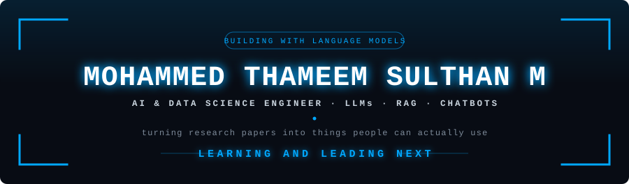

 

 

---

## 🔹 About Me

I build intelligent systems that sit close to real users — retrieval-augmented assistants, conversational interfaces, and the data work that keeps them honest.

<table>
<tr>
<td width="50%" valign="top">

**🎓 Education**
B.Tech, Artificial Intelligence & Data Science
St. Joseph's College of Engineering, Chennai

**🎯 Focus**
Large Language Models · RAG pipelines · Chatbots

</td>
<td width="50%" valign="top">

**🎖️ Role**
HCLTech Campus Ambassador

**💼 Track record**
3 internships across AI/ML and core engineering

</td>
</tr>
</table>

<b>🟦 Currently exploring →</b>

 

- Retrieval strategies for RAG beyond naive top-k
- Agentic workflows and tool-calling with LLMs
- Evaluation methods for chatbot response quality
- Whatever just shipped in generative AI this week

<b>🟦 A bit more about how I work →</b>

 

I move between the applied and the exploratory — shipping a working prototype fast, then going back to understand why it actually works. Hackathons taught me the first half; internships across AI/ML and core engineering taught me the second.

---

## 🔹 Tech Stack

  

---

## 🔹 Experience

| Role | Organisation | Duration | What I did |
| :--- | :--- | :--- | :--- |
| **AI Intern** | CodeWorks Pro | — | Applied AI projects and model development |
| **AI & ML Intern** | Kaaspro Enterprises | 1 month | ML workflows and data-driven problem solving |
| **Intern, Drone Sector** | Kothari Industrial Corporation Ltd | 10 days | Drone technology and its engineering applications |

---

## 🔹 Achievements

---

## 🔹 GitHub Activity

---

## 🔹 Open To

<b>📬 Get in touch →</b>

 

| | |
| :-- | :-- |
| **LinkedIn** | [Mohammed Thameem Sulthan M](https://www.linkedin.com/in/mohammed-thameem-sulthan-m-01648a328/) |
| **Email** | [thameem.s.ads@gmail.com](mailto:thameem.s.ads@gmail.com) |
| **Location** | Chennai, India |

`// thanks for stopping by`

